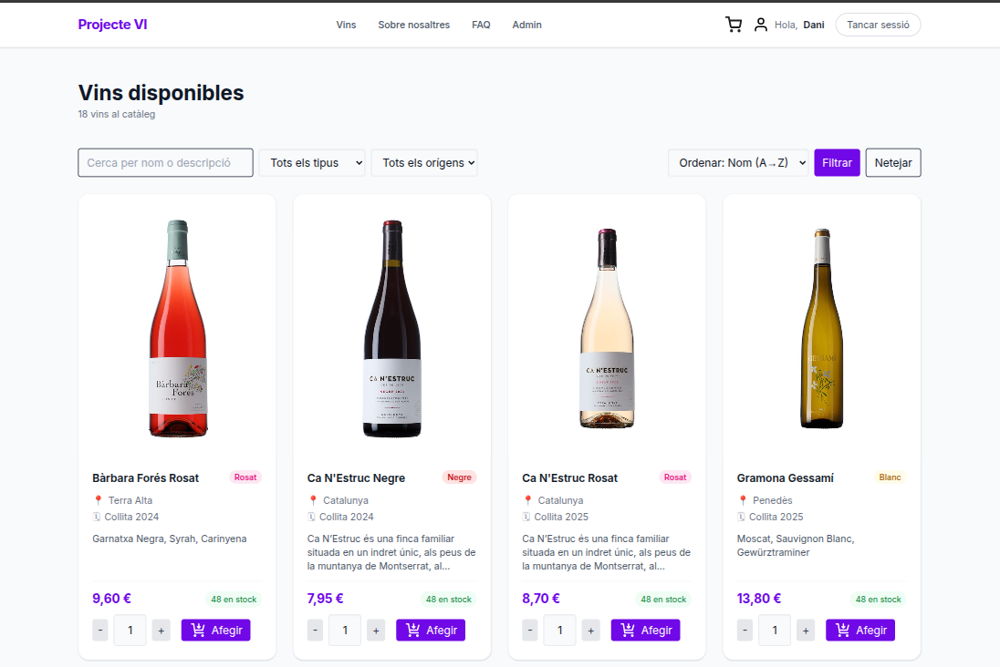
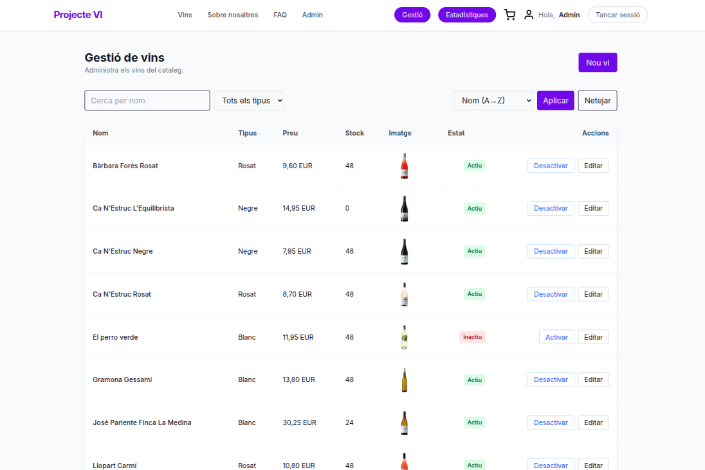
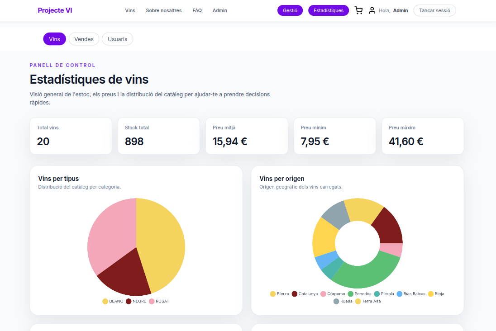

# Projecte Vi 🍷

[](https://www.python.org/)
[](https://www.djangoproject.com/)
[](https://developer.mozilla.org/en-US/docs/Web/JavaScript)
[](https://tailwindcss.com/)
[](https://www.mysql.com/)
[](https://www.chartjs.org/)
[](https://nodejs.org/)
[](https://www.npmjs.com/)

## Web desenvolupada amb **Django 5.1** per gestionar i vendre vins en línia
### Home

### Catàleg de vins

### Gestor de vins

### Estadistiques

## Estructura del projecte

```
projecte_vi/
├── core/               # Configuració principal (settings, urls, wsgi, asgi)
├── apps/
│   ├── vins/           # Gestió del catàleg de vins
│   ├── usuaris/        # Registre, login i adreça d'enviament
│   ├── comandes/       # Gestió de comandes
│   └── subscripcions/  # Subscripcions / newsletter
├── templates/          # Plantilles base i components compartits (nav, footer)
├── static/             # CSS (Tailwind), JS i imatges estàtiques
├── media/              # Imatges pujades (vins/)
└── manage.py
```

## Aplicacions

### `apps.vins` — Catàleg de vins
- **Model `Vi`**: nom, origen, tipus (Blanc · Negre · Rosat · Espumos), preu, estoc, any de collita, imatge i descripció.
- Vistes: llistat de vins disponibles (`stock > 0`).
- Imatges desades a `media/vins/`.

### `apps.usuaris` — Gestió d'usuaris
- **Registre** (`UserRegisterForm`): crea un `User` de Django amb correu com a `username`, i una `Adreça` associada (CP, població, carrer, número). Inclou validacions de format i seguretat.
- **Login** (`UserLoginForm`): autenticació per correu i contrasenya amb protecció `django-axes` (bloqueig després de 3 intents fallits, desbloqueix al cap d'1 hora).
- **Logout**: sessió tancada i redirecció a la pàgina principal.
- **Model `Adreces`**: relació `OneToOne` amb `User` (CP, població, carrer, número).

### `apps.comandes` — Comandes
- Estructura bàsica per gestionar comandes dels usuaris.

### `apps.subscripcions` — Subscripcions
- Estructura bàsica per gestionar subscripcions / newsletter.

## Arquitectura de 3 capes

```text
Usuari → URL → Vista (views.py) → Model (models.py) → BD MySQL
                    ↓
              Plantilla (templates/)
```

1. **Model** — Defineix l'estructura de dades i la persistència a MySQL.
2. **Vista** — Lògica de negoci: recupera dades dels models, valida formularis i passa el context a les plantilles.
3. **Plantilla** — Renderitza la interfície i els formularis; rep les dades de la vista per mostrar-les a l'usuari final.

### Exemples del flux en el projecte

#### 1. Creació d'un usuari (Registre)
- **Plantilla**: L'usuari accedeix a `/usuaris/registre/` i veu el formulari renderitzat com a HTML per emplenar les dades (correu, contrasenya, adreça) i les envia per mètode `POST`.
- **Vista**: El controlador rep les dades (`request.POST`). Implementa la lògica de negoci: verifica que les contrasenyes coincideixen, que el correu no estigui ja en ús validant correctament el formulari corresponent.
- **Model**: Un cop les dades queden validades en la vista, s'utilitza el model `User` preexistent de Django i la classe nativa per guardar les credencials del nou usuari (tot encriptant la contrasenya). A continuació, utilitza el seu propi model `Adreces` per desar les dades de l'adreça al seu nom dins la relació establerta amb el nou usuari i les fa persistents sobre la BD MySQL.

#### 2. Crear, Modificar i Borrar un Vi (Gestió de Catàleg)
El flux és seguit des de l'app relacionada directament a la gestió pròpia.
- **Crear un vi**:
  - **Plantilla**: L'usuari (Gestor o Staff) accedeix a l'apartat de creació generant un formulari en blanc, llest per adjuntar els texts i la imatge descriptiva. 
  - **Vista**: En rebre el formulari en format de dades `POST` i a la vegada el mateix arxiu d'imatge (`request.FILES`), en valida tots els camps obligatoris i formats adients.
  - **Model**: La vista fa que s'instanciï un objecte del model `Vi` introduint els valor validats i hi executa `save()`. L'ORM finalment ho traduirà per executar la corresponent instrucció de guardat `INSERT` a MySQL i el fitxer quedarà enmagatzemat a `media/vins/`.

- **Modificar un vi**:
  - **Vista i Model**: Mitjançant la ID del vi sol·licitat, la vista inicial farà un `query`, és a dir instanciarà pel propi model en concret (com ara `Vi.objects.get(...)`) extraient un diccionari amb les dades preexistents sobre MySQL previ de cridar i visualitzar a la plantilla.
  - **Plantilla**: Això es tradueix a poder renderitzar al complet el formulari de modificació d'aquesta vista instanciada: el pinta pre-omplert (amb la instància llançada des de la vista com a variables del context des del *backend*), i a més s'hi adjunta la referència desitjada o l'arxiu d'imatge anterior adjunt en previsualització.
  - **Actualització**: El Gestor envia finalitzades totes les modificacions oportunes alterades pel POST; la **Vista** torna a recollir aquells canvis processats per assignar-los sobre el **Model** obtingut inicialment de la base de dates validant novament per acabar amb l'arxiu `save()` utilitzant així instàncies com instruccions utilitàries del model equivalent cap a `UPDATE`.


## Seguretat

- **`django-axes`**: bloqueig automàtic per `username`, `ip_address`, `user_agent`, `path_info` i `http_accept` després de 3 intents fallits.
- **CSRF**: activat per defecte en tots els formularis.
- **Contrasenyes**: amb hash via `set_password()`; validadors de Django activats (longitud, complexitat, etc.).

## Com executar el projecte

### Configuració ràpida (recomanat)
```bash
cd ./projecte_vi
chmod +x setup.sh
./setup.sh
```


### Configuració manual
1. **Instal·la Python, venv, nodejs, npm i MySQL**:
   ```bash
   sudo apt update
   sudo apt install -y python3 python3-venv python3-pip nodejs npm mysql-server
   ```

2. **Configura MySQL** (substitueix `contrasenya_a_escollir` per una contrasenya forta):
   ```bash
   sudo mysql -u root
   ```
   ```sql
   CREATE DATABASE projecte_vi CHARACTER SET utf8mb4 COLLATE utf8mb4_unicode_ci;
   CREATE USER 'projecte_user'@'127.0.0.1' IDENTIFIED BY 'contrasenya_a_escollir';
   GRANT ALL PRIVILEGES ON projecte_vi.* TO 'projecte_user'@'127.0.0.1';
   FLUSH PRIVILEGES;
   EXIT;
   ```

3. **Carrega zones horàries a MySQL** (recomanat):
   ```bash
   sudo mysql_tzinfo_to_sql /usr/share/zoneinfo | sudo mysql -u root mysql
   sudo mysql -u root -e "GRANT SELECT ON mysql.time_zone TO 'projecte_user'@'127.0.0.1'; \
     GRANT SELECT ON mysql.time_zone_name TO 'projecte_user'@'127.0.0.1'; \
     GRANT SELECT ON mysql.time_zone_transition TO 'projecte_user'@'127.0.0.1'; \
     GRANT SELECT ON mysql.time_zone_transition_type TO 'projecte_user'@'127.0.0.1'; \
     FLUSH PRIVILEGES;"
   ```

4. **Crea i activa l'entorn virtual**:
   ```bash
   python3 -m venv venv
   source venv/bin/activate
   ```

5. **Crea el fitxer `.env` a l'arrel del projecte**:
   ```env
   DB_NAME=projecte_vi
   DB_USER=projecte_user
   DB_PASSWORD=contrasenya_a_escollir
   DB_HOST=127.0.0.1
   DB_PORT=3306
   ```

6. **Instal·la dependències de sistema** (necessari per `mysqlclient` a Ubuntu/Debian):
   ```bash
   sudo apt update
   sudo apt install -y python3-dev default-libmysqlclient-dev build-essential pkg-config
   ```

7. **Instal·la dependències de Python**:
   ```bash
   pip install -r requirements.txt
   ```

8. **Aplica migracions**:
   ```bash
   python manage.py migrate
   ```

9. **Carrega les dades inicials** (fixture amb vins, usuaris, comandes, etc.):
   ```bash
   python manage.py loaddata bbdd.json
   ```
   Si la BD ja té dades i vols recarregar el fixture netament:
   ```bash
   python manage.py flush --noinput
   python manage.py loaddata bbdd.json
   ```

10. **Crea un superusuari** (opcional, per accedir a `/admin`):
    ```bash
    python manage.py createsuperuser
    ```

11. **Instal·la dependències de Node.js i compila Tailwind CSS** (en una terminal separada):
    ```bash
    npm install
    npm run build:css
    # Mode watch
    npm run watch:css
    ```

12. **Executa el servidor**:
    ```bash
    python manage.py runserver
    ```
